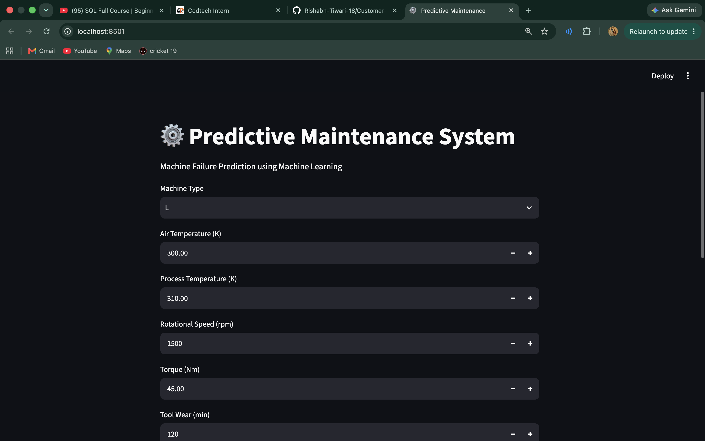
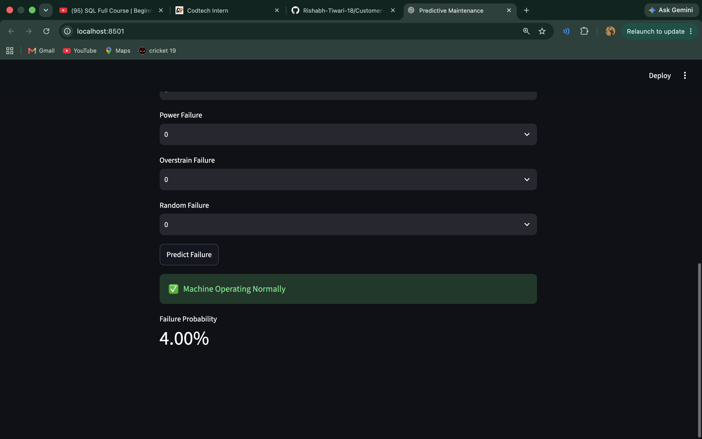

# Predictive Maintenance Using Machine Learning



## Internship Details

**Organization:** CODTECH IT Solutions Private Limited  

**Candidate Name:** Rishabh Tiwari  

**Selected For:** Data Science  

**Intern ID:** CITS4934  

**Duration:** 8 Weeks  

**Internship Period:** 18 June 2026 - 13 August 2026  


---

# Project Name

## Machine Failure Prediction System Using Machine Learning


---

# Project Overview

Predictive Maintenance is a machine learning approach used to predict equipment failures before they happen.

This project develops a classification system that analyzes industrial machine sensor data and predicts whether a machine is likely to fail.

The objective is to reduce unexpected machine downtime and support proactive maintenance decisions.


---

# Project Scope

The model uses industrial machine parameters:

- Air Temperature
- Process Temperature
- Rotational Speed
- Torque
- Tool Wear
- Machine Type


The system predicts:

```
0 → Machine Normal
1 → Machine Failure
```


---

# Dataset Information

The dataset contains industrial machine operating conditions with failure labels.

Failure categories:

- TWF - Tool Wear Failure
- HDF - Heat Dissipation Failure
- PWF - Power Failure
- OSF - Overstrain Failure
- RNF - Random Failure


---

# Project Workflow

## 1. Exploratory Data Analysis

Performed:

- Dataset understanding
- Statistical analysis
- Missing value analysis
- Data visualization
- Failure distribution analysis


Notebook:

```
notebooks/01_EDA.ipynb
```


---

## 2. Data Preprocessing

Steps performed:

- Missing value handling
- Duplicate checking
- Column name cleaning
- Feature scaling
- Train-test splitting


Notebook:

```
notebooks/02_Preprocessing.ipynb
```


---

## 3. Feature Engineering

Created additional machine health features:

- Temperature Difference
- Machine Power
- Wear Rate
- Heat Index
- Mechanical Stress
- Temperature Ratio
- RPM per Torque
- Power per Wear


Notebook:

```
notebooks/03_Feature_Engineering.ipynb
```


---

## 4. Model Training

Implemented machine learning algorithms:

- Logistic Regression
- Random Forest
- Extra Trees
- XGBoost
- LightGBM
- CatBoost


Notebook:

```
notebooks/04_Model_Training.ipynb
```


---

## 5. Model Evaluation

Evaluation metrics:

- Accuracy
- Precision
- Recall
- F1 Score
- ROC-AUC
- MCC Score


Additional analysis:

- Confusion Matrix
- ROC Curve
- Precision Recall Curve
- SHAP Feature Importance
- Threshold Analysis


Notebook:

```
notebooks/05_Model_Evaluation.ipynb
```


---

# Model Performance


## Best Model: Extra Trees Classifier


| Metric | Score |
|---|---:|
| Accuracy | 99.15% |
| Precision | 81.48% |
| Recall | 97.06% |
| F1 Score | 88.59% |
| ROC-AUC | 99.49% |
| MCC | 88.51% |


---

# Prediction Example





Example:

```
Machine Failure Prediction: 0

Failure Probability: 4.0 %
```


The model predicts that the machine is operating normally with low failure probability.


---

# Project Structure


```
Predictive_Maintenance_Project/

│
├── data/
│   ├── raw/
│   └── processed/
│
├── notebooks/
│   ├── 01_EDA.ipynb
│   ├── 02_Preprocessing.ipynb
│   ├── 03_Feature_Engineering.ipynb
│   ├── 04_Model_Training.ipynb
│   └── 05_Model_Evaluation.ipynb
│
├── src/
│   ├── preprocessing.py
│   ├── feature_engineering.py
│   ├── train.py
│   └── predict.py
│
├── models/
│
├── app/
│   └── app.py
│
├── reports/
│
├── images/
│   ├── home.png
│   └── prediction.png
│
├── README.md
├── requirements.txt
└── LICENSE
```


---

# Source Code

The project contains reusable Python modules:

```
src/

├── preprocessing.py
├── feature_engineering.py
├── train.py
└── predict.py
```


---

# Application Interface


The application allows users to enter machine parameters and receive failure predictions.


---

# Technologies Used


## Programming Language

- Python


## Machine Learning Libraries

- Scikit-learn
- XGBoost
- LightGBM
- CatBoost


## Data Processing

- Pandas
- NumPy


## Visualization

- Matplotlib
- Seaborn


## Explainable AI

- SHAP


## Tools

- Jupyter Notebook
- VS Code
- Git/GitHub


---

# Documentation

This project documentation includes:

- Data preprocessing pipeline
- Feature engineering methodology
- Machine learning model comparison
- Model evaluation results
- Prediction workflow


---

# Conclusion

This project demonstrates the application of machine learning for predictive maintenance.

The developed model successfully identifies potential machine failures with high accuracy and recall, helping industries reduce downtime and improve maintenance efficiency.